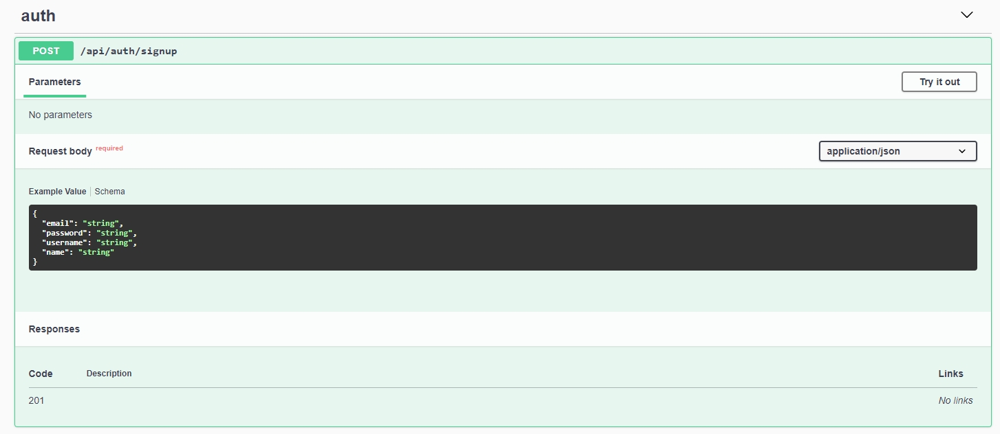

# Práctica módulo **Fundamentos de React**

## Introducción

Este proyecto consiste en crear una aplicación de tipo dashboard desarrollada con React para gestionar la API de Nodepop, un servicio de backend para anuncios clasificados. Esta aplicación, diseñada específicamente para entornos de escritorio, nos permite aplicar los conocimientos adquiridos durante el módulo actual, fortaleciendo así nuestra base teórica y práctica. De esta manera, aseguramos una preparación óptima para afrontar el módulo avanzado de React.

Os comparto toda la información sobre la práctica en el siguiente [documento](./Practica_Fundamentos.pdf).

## Configuración del backend

El backend para este proyecto se encuentra en:

[Repositorio de GitHub de la API Nodepop](https://github.com/davidjj76/nodepop-api)

1. Clonar el repositorio:

```sh
git clone git@github.com:davidjj76/nodepop-api.git
```

2. Instalar las dependencias:

```sh
npm install
```

3. Iniciar el servidor:

```sh
npm start
```

4. Consulte la documentación [Swagger](http://localhost:3001/swagger) de la API para registrar un usuario y así poder iniciar sesión en la aplicación correspondiente a la práctica.

```http
http://localhost:3001/swagger
```



> [!IMPORTANT]
> Dado que la aplicación carece de una sección `SignUp`, resulta imprescindible registrar al usuario utilizando la documentación Swagger.

## Aplicación Frontend

### Tecnologías

Esta Aplicación de Página Única (SPA) la he construido con React, utilizando el empaquetador Vite, que ofrece tiempos de inicio más rápidos y un rendimiento optimizado durante el desarrollo.

### Ejecución del proyecto

1. Clonar el repositorio:

```sh
git clone git@github.com:Cespuess/Practica-React-Nodepop.git
```

2. Instalar las dependencias:

```sh
npm install
```

3. Iniciar el servidor de desarrollo:

```sh
npm run dev
```

4. Acceder a [Nodepop](http://localhost:5173/)

```
http://localhost:5173/
```

### Páginas y enrutamiento

- **Rutas públicas:**
  - `/login`: Página para la autenticación de usuarios.
- **Rutas Protegidas (requieren autenticación):**
  - `/`: Redirecciona a `/adverts`.
  - `/adverts`: Página principal que muestra todos los anuncios.
  - `/adverts/:id`: Vista detallada del anuncio seleccionado.
  - `/adverts/new`: Página de creación de un nuevo anuncio.
  - Cualquier URL no coincidente redirigirá a una página de error 404

> [!NOTE]
> Si intenta acceder a cualquier página de las anteriormente nombradas sin estar autentificado, será redireccionado a `/login`.

### Funcionalidades de cada página-componente

- **LoginPage:** Formulario de inicio de sesión con campos para email y contraseña. Opción de `Recordar Sesión` para mantener al usuario conectado.
- **AdvertsPage:** Lista de anuncios con opciones de filtrado como nombre, tipo de transacción y etiquetas.
- **AdvertDetail:** Vista detallada del anuncio seleccionado, con la opción de poderlo eliminar.
- **CrateAdvert:** Formulario para la creación de un nuevo anuncio.

Espero que les guste este proyecto. Si tienen sugerencias de mejoras o desean contribuir, no duden en abrir un issue o enviar un pull request. Agradezco su colaboración y feedback.
